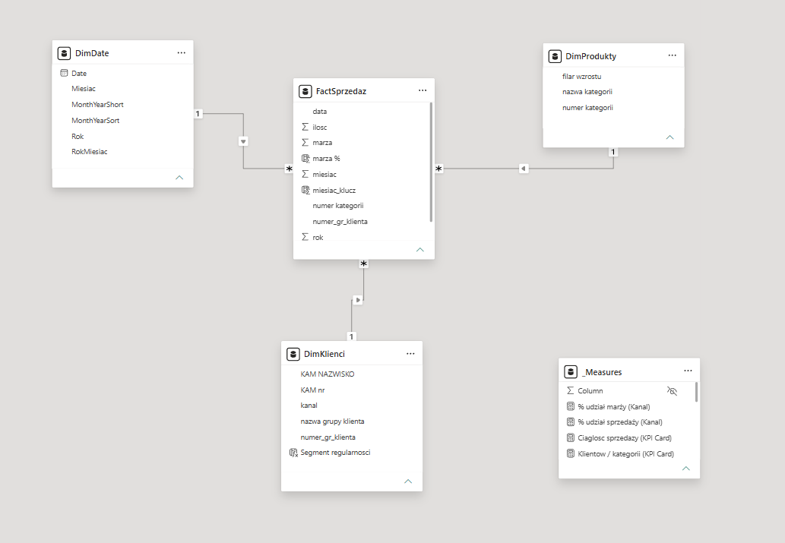
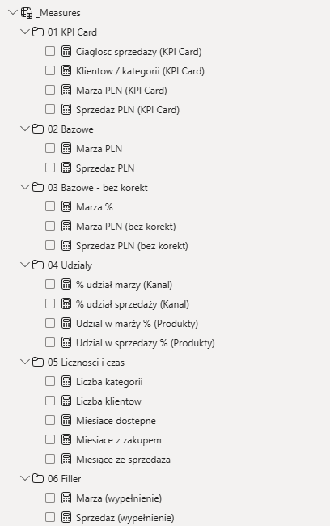

# Dokumentacja metodologiczna - model danych, DAX i Power Query

Opracowanie dokumentuje konstrukcję modelu Power BI stanowiącego podstawę raportu **VIOLA NOVA - analiza klientów kluczowych**. Przedmiotem opisu są: architektura modelu, tabela czasu, zbiór miar DAX, kolumny obliczane, organizacja modelu (foldery prezentacyjne) oraz przyjęte założenia projektowe.

 Polski · [English below](#-english)

---

## Spis treści

1. [Architektura modelu (schemat gwiazdy)](#1-architektura-modelu)
2. [Tabela czasu (DimDate)](#2-tabela-czasu-dimdate)
3. [Tabela faktów (FactSprzedaz)](#3-tabela-faktów-factsprzedaz)
4. [Wymiary (DimKlienci, DimProdukty)](#4-wymiary)
5. [Miary DAX](#5-miary-dax)
6. [Organizacja modelu - foldery prezentacyjne](#6-organizacja-modelu)
7. [Założenia projektowe](#7-założenia-projektowe)
8. [Weryfikacja wartości](#8-weryfikacja-wartości)

---

## 1. Architektura modelu

Model opiera się na schemacie gwiazdy (*star schema*): centralną tabelę faktów `FactSprzedaz` otacza zestaw trzech tabel wymiarów. Miary zgromadzono w wyodrębnionej tabeli `_Measures`, pełniącej funkcję kontenera pozbawionego danych.



**Relacje:**

| Strona „1" | Strona „*" | Klucz | Kardynalność | Kierunek filtra |
|---|---|---|---|---|
| `DimDate` | `FactSprzedaz` | `Date` `data` | 1:* | jednokierunkowy |
| `DimKlienci` | `FactSprzedaz` | `numer_gr_klienta` | 1:* | jednokierunkowy |
| `DimProdukty` | `FactSprzedaz` | `numer kategorii` | 1:* | jednokierunkowy |

Wszystkie relacje mają charakter jednokierunkowy - filtr propaguje się od wymiaru ku tabeli faktów. Zrezygnowano z relacji dwukierunkowych ze względu na wprowadzaną przez nie niejednoznaczność ścieżek filtrowania oraz trudne do zdiagnozowania błędy w miarach. W przypadkach wymagających przeniesienia filtra od faktów ku wymiarowi zastosowano rozwiązanie lokalne na poziomie miary (wzorzec `FILTER` na `VALUES`), a nie modyfikację globalną na relacji.

Wybór schematu gwiazdy uzasadnia charakter danych: wymiary są niewielkie i opisowe, tabela faktów obszerna i liczbowa. Model taki cechuje się wysoką wydajnością oraz czytelnością i umożliwia filtrowanie sprzedaży według dowolnego atrybutu wymiaru (kanał, filar, opiekun, miesiąc) bez powielania danych.

---

## 2. Tabela czasu (DimDate)

Tabela kalendarza została wygenerowana w języku DAX. Przyjęto zasadę, zgodnie z którą kalendarz rozpoczyna się zawsze 1 stycznia roku pierwszej sprzedaży, bez odwołania do stałych liczbowych zależnych od konkretnej daty.

```dax
DimDate =
VAR PierwszaData = MIN ( FactSprzedaz[data] )
VAR OstatniaData = MAX ( FactSprzedaz[data] )
VAR StartKalendarza = DATE ( YEAR ( PierwszaData ), 1, 1 )
VAR KoniecKalendarza = OstatniaData
RETURN
ADDCOLUMNS (
 CALENDAR ( StartKalendarza, KoniecKalendarza ),
 "Rok", YEAR ( [Date] ),
 "Miesiac", MONTH ( [Date] ),
 "RokMiesiac", FORMAT ( [Date], "YYYY-MM" ), -- tekst "2025-02"
 "MonthYearSort", YEAR ( [Date] ) * 100 + MONTH ( [Date] ), -- klucz liczbowy 202502
 "MonthYearShort", FORMAT ( [Date], "MMM yy", "pl-PL" ) -- etykieta osi "lut 25"
)
```

| Kolumna | Typ | Funkcja |
|---|---|---|
| `Date` | Date | klucz relacji do `FactSprzedaz[data]` |
| `Rok` | Int | atrybut roku |
| `Miesiac` | Int | numer miesiąca (1–12) |
| `RokMiesiac` | Text | `"2025-02"` - czytelny identyfikator rok-miesiąc |
| `MonthYearSort` | Int | `202502` - klucz sortujący, unikatowy w skali rok-miesiąc |
| `MonthYearShort` | Text | `"lut 25"` - etykieta osi wykresów |

**Uzasadnienie konstrukcji `DATE(YEAR(PierwszaData), 1, 1)` wobec wariantu `MIN(data) - N`.** Pierwsza transakcja przypada na 28 lutego 2025 roku. Cofnięcie początku kalendarza przez odjęcie stałej liczby dni jest wprawdzie możliwe, lecz stała taka koduje ukryte założenie dotyczące konkretnej daty początkowej i traci ważność przy zmianie danych (dodanie kolejnego miesiąca, zmiana źródła). Konstrukcja `DATE(YEAR(...), 1, 1)` wyraża intencję wprost - rozpoczęcie od początku roku - i zachowuje poprawność niezależnie od momentu wystąpienia pierwszej transakcji.

**Konfiguracja po stronie modelu (wymagana):**
- Oznaczenie tabeli: `Mark as date table` kolumna `Date`, co warunkuje poprawne działanie funkcji analizy czasowej.
- Ustawienie sortowania etykiety: `MonthYearShort` `Sort by column` `MonthYearSort`. W przeciwnym razie oś porządkowana jest alfabetycznie (kwi, lip, lut…) zamiast chronologicznie.

> **Możliwe rozszerzenie:** domknięcie kalendarza wartością `DATE(YEAR(OstatniaData), 12, 31)` zapewniłoby pełne lata, co zabezpiecza funkcje typu YTD w obrębie ostatniego, niepełnego roku. W obecnym opracowaniu nie jest to konieczne (brak miar YTD), wobec czego kalendarz kończy się na dacie ostatniej sprzedaży.

---

## 3. Tabela faktów (FactSprzedaz)

Tabela liczy 2 412 wierszy. Ziarno (poziom szczegółowości) definiuje się następująco: jeden wiersz odpowiada sprzedaży jednej kategorii produktowej u jednego klienta w danym miesiącu.

| Kolumna | Typ | Opis |
|---|---|---|
| `data` | Date | koniec miesiąca rozliczeniowego; klucz relacji do `DimDate` |
| `miesiac`, `rok` | Int | pomocnicze pola czasu (pochodzące ze źródła) |
| `miesiac_klucz` | Int | klucz rok-miesiąc (`202502`), wykorzystywany w miarach zliczających miesiące |
| `numer_gr_klienta` | Int | klucz obcy `DimKlienci` |
| `numer kategorii` | Int | klucz obcy `DimProdukty` |
| `ilosc` | Int | liczba sztuk |
| `sprzedaz` | Decimal | wartość sprzedaży netto (PLN) |
| `marza` | Decimal | marża kwotowa (PLN) |
| `marza %` | obliczana | marża procentowa na poziomie wiersza |

---

## 4. Wymiary

### DimKlienci (8 wierszy)
Słownik grup klientów wraz z przypisaniem kanału oraz opiekuna handlowego (KAM).

| Kolumna | Opis |
|---|---|
| `numer_gr_klienta` | klucz główny |
| `nazwa grupy klienta` | nazwa sieci/klienta (HIPER CENTRUM, GRUPA DETAL…) |
| `kanal` | SIECI / TRADYCJA |
| `KAM nr`, `KAM NAZWISKO` | opiekun klienta (Key Account Manager) |
| `Nazwa GR klienta i kanal` | kolumna obliczana - etykieta złożona „nazwa + kanał" na potrzeby osi wykresów (np. „HIPER CENTRUM SIECI") |
| `Segment regularnosci` | kolumna obliczana - klasyfikacja stabilności sprzedaży klienta (Stały / Nieregularny) |

### DimProdukty (158 wierszy)
Słownik kategorii produktowych z przypisaniem do filaru wzrostu.

| Kolumna | Opis |
|---|---|
| `numer kategorii` | klucz główny |
| `nazwa kategorii` | nazwa kategorii (NOVAMED, HANDYPACK…) |
| `filar wzrostu` | Leki/Wyroby Medyczne · Zdrowa Żywność · Pozostałe · Kosmetyki |

---

## 5. Miary DAX

Wszystkie wskaźniki mają postać miar (nie kolumn) i podlegają obliczeniu w kontekście filtra danej wizualizacji. Zgromadzono je w tabeli `_Measures`.

### 5.1. Miary bazowe
Sumy podstawowe, stanowiące fundament pozostałych konstrukcji.
```dax
Sprzedaz PLN = SUM ( FactSprzedaz[sprzedaz] )
Marza PLN = SUM ( FactSprzedaz[marza] )
```

### 5.2. Miary „bez korekt"
Warianty ograniczone do wartości dodatnich - to one znajdują zastosowanie w raporcie, ponieważ eliminują korekty i zwroty zniekształcające obraz.
```dax
Sprzedaz PLN (bez korekt) =
CALCULATE ( [Sprzedaz PLN], FactSprzedaz[sprzedaz] > 0 )

Marza PLN (bez korekt) =
CALCULATE ( [Marza PLN], FactSprzedaz[marza] > 0 )

Marza % = DIVIDE ( [Marza PLN], [Sprzedaz PLN] )
```
Zastosowanie funkcji `DIVIDE` zamiast operatora `/` zapewnia bezpieczną obsługę dzielenia przez zero (zwrócenie wartości pustej zamiast błędu). Marża średnia raportu (26,1%) stanowi marżę ważoną całego portfela (marża łączna ÷ sprzedaż łączna), a nie prostą średnią z marż kategorii; średnia prosta nadmiernie uwzględniałaby kategorie o marginalnym udziale.

### 5.3. Udziały - Produkty
Udział kategorii w całości asortymentu. Konstrukcja `ALL(DimProdukty)` usuwa filtry z całej tabeli produktów, w efekcie czego mianownik przyjmuje wartość całkowitą.
```dax
Udzial w sprzedazy % (Produkty) =
DIVIDE (
 [Sprzedaz PLN (bez korekt)],
 CALCULATE ( [Sprzedaz PLN (bez korekt)], ALL ( DimProdukty ) )
)

Udzial w marży % (Produkty) =
DIVIDE (
 [Marza PLN (bez korekt)],
 CALCULATE ( [Marza PLN (bez korekt)], ALL ( DimProdukty ) )
)
```

### 5.4. Udziały - Kanał
Udział kanału. W tym przypadku konstrukcja `ALL(DimKlienci[kanal])` usuwa filtr wyłącznie z kolumny `kanal`, pozostawiając aktywnymi pozostałe filtry tabeli klientów (nazwa, opiekun). Rozwiązanie to jest zamierzone: przedmiotem pomiaru jest udział kanału w obrębie aktualnie wybranego zakresu klientów.
```dax
% udział sprzedaży (Kanal) =
DIVIDE (
 [Sprzedaz PLN (bez korekt)],
 CALCULATE ( [Sprzedaz PLN (bez korekt)], ALL ( DimKlienci[kanal] ) )
)

% udział marży (Kanal) =
DIVIDE (
 [Marza PLN (bez korekt)],
 CALCULATE ( [Marza PLN (bez korekt)], ALL ( DimKlienci[kanal] ) )
)
```

> **Rozróżnienie `ALL(tabela)` - `ALL(kolumna)`:** konstrukcja `ALL(DimProdukty)` usuwa filtry z całej tabeli (udział „w całości asortymentu, bezwarunkowo"), natomiast `ALL(DimKlienci[kanal])` usuwa filtr z pojedynczej kolumny (udział „w obrębie zakresu wyznaczonego przez pozostałe kolumny"). Dobór ma charakter celowy - pierwsza konstrukcja służy analizie struktury asortymentu, druga - struktury kanałowej w kontekście wybranych klientów.

### 5.5. Liczności i czas
```dax
Liczba kategorii = DISTINCTCOUNT ( FactSprzedaz[numer kategorii] )
Liczba klientow = DISTINCTCOUNT ( DimKlienci[numer_gr_klienta] )

-- miesiące o dodatnim obrocie (licznik wskaźnika ciągłości = 12)
Miesiace dostepne =
CALCULATE (
 DISTINCTCOUNT ( FactSprzedaz[miesiac_klucz] ),
 ALL ( DimKlienci ),
 FactSprzedaz[sprzedaz] > 0
)

-- liczba miesięcy w zakresie kalendarza (mianownik = 17)
Miesiące ze sprzedaza = DISTINCTCOUNT ( DimDate[RokMiesiac] )
```
**Zastosowanie dwóch źródeł prawdy.** Licznik (miesiące o obrocie) obliczono na podstawie tabeli faktów (`miesiac_klucz` z warunkiem `sprzedaz > 0`), przedmiotem pomiaru jest bowiem aktywność sprzedażowa. Mianownik (długość okresu) wyprowadzono z kalendarza (`DimDate`), ponieważ także miesiąc pozbawiony obrotu wlicza się do zakresu. Kolumna `miesiac_klucz` stanowi klucz rok-miesiąc (`202502`), dzięki czemu styczeń 2025 i styczeń 2026 nie ulegają scaleniu.

> *Uwaga porządkowa:* model zawiera również miarę `Miesiace z zakupem` (analogiczna logika bez `ALL(DimKlienci)`), stanowiącą funkcjonalny duplikat miary `Miesiace dostepne`. W razie braku zastosowania na którejkolwiek wizualizacji miara ta pozostaje kandydatem do usunięcia lub archiwizacji.

### 5.6. Miary kart KPI
Sformatowane miary tekstowe przeznaczone dla kart w górnej części raportu.
```dax
Sprzedaz PLN (KPI Card) =
ROUND ( [Sprzedaz PLN (bez korekt)] / 1000000, 2 ) & " mln zł"

Marza PLN (KPI Card) =
ROUND ( [Marza PLN (bez korekt)] / 1000, 0 ) & " tyś. zł"

Klientow / kategorii (KPI Card) = [Liczba klientow] & " / " & [Liczba kategorii]

Ciaglosc sprzedazy (KPI Card) =
[Miesiace dostepne] & " / " & [Miesiące ze sprzedaza] & " mies."
```

### 5.7. Miary pomocnicze - wypełnienie luk na wykresie
Sprzedaż wykazuje nieregularność (5 z 17 miesięcy pozbawionych obrotu). W celu zachowania ciągłości linii trendu na miesiącach pustych zastosowano miary interpolujące liniowo wartość między najbliższym niepustym punktem wstecz i w przód. Miary te pełnią wyłącznie funkcję warstwy wizualnej (linia ciągła) i występują obok rzeczywistych punktów sprzedaży.

```dax
Sprzedaż (wypełnienie) =
VAR Wartosc = [Sprzedaz PLN (bez korekt)]
VAR CzyPusty = ISBLANK ( Wartosc )
VAR DataBiez = MAX ( DimDate[Date] )
VAR PoprzedniaData =
 CALCULATE (
 MAX ( DimDate[Date] ),
 FILTER ( ALL ( DimDate ),
 DimDate[Date] < DataBiez && NOT ISBLANK ( [Sprzedaz PLN (bez korekt)] ) )
 )
VAR NastepnaData =
 CALCULATE (
 MIN ( DimDate[Date] ),
 FILTER ( ALL ( DimDate ),
 DimDate[Date] > DataBiez && NOT ISBLANK ( [Sprzedaz PLN (bez korekt)] ) )
 )
VAR WartoscPoprz =
 CALCULATE ( [Sprzedaz PLN (bez korekt)],
 FILTER ( ALL ( DimDate ), DimDate[Date] = PoprzedniaData ) )
VAR WartoscNast =
 CALCULATE ( [Sprzedaz PLN (bez korekt)],
 FILTER ( ALL ( DimDate ), DimDate[Date] = NastepnaData ) )
VAR Interpol =
 WartoscPoprz
 + ( WartoscNast - WartoscPoprz )
 * DIVIDE ( DataBiez - PoprzedniaData, NastepnaData - PoprzedniaData )
RETURN
 IF ( CzyPusty, Interpol, Wartosc )
```
Miara `Marza (wypełnienie)` ma budowę analogiczną, opartą na `Marza PLN (bez korekt)`.

---

## 6. Organizacja modelu

Miary uporządkowano w folderach prezentacyjnych (panel Pól właściwość *Display folder*). Numeracja wymusza porządek, ponieważ Power BI sortuje foldery alfabetycznie.



Struktura obejmuje sześć folderów: **01 KPI Card** (sformatowane miary tekstowe kart), **02 Bazowe** (sumy podstawowe), **03 Bazowe - bez korekt** (warianty z filtrem `> 0` oraz marża %), **04 Udziały** (udziały kanałowe i produktowe), **05 Liczności i czas** (zliczenia klientów, kategorii i miesięcy), **06 Filler** (interpolacja luk na wykresach).

Zasadę porządkowania podporządkowano częstości i istotności użycia: na górze umieszczono elementy najczęściej wykorzystywane i najważniejsze (karty KPI), pośrodku warstwy analityczne, na dole warstwę wyłącznie pomocniczą (interpolacja luk).

---

## 7. Założenia projektowe

- **Kalendarz wolny od stałych umownych.** Początek kalendarza wyrażono przez intencję (`DATE(YEAR(...), 1, 1)`), a nie stałą liczbę dni, co zapewnia odporność na zmianę danych.
- **Relacje jednokierunkowe.** Przeniesienie filtra rozwiązano lokalnie na poziomie miary, nie zaś globalnie na relacji, co chroni pozostałą część modelu przed niejednoznacznością.
- **Dwa źródła prawdy dla czasu.** Aktywność (miesiące o obrocie) wyprowadzono z faktów, długość okresu - z kalendarza; każdą wielkość obliczono z właściwej tabeli.
- **Kategoria „bez korekt" jako standard.** Warstwa miar z filtrem `> 0` oddziela dane prezentacyjne od surowych, zapewniając spójny obraz w całym raporcie.
- **Interpolacja luk wyłącznie w warstwie wizualnej.** Linie wypełnione nie zastępują danych rzeczywistych, lecz stanowią odrębną warstwę służącą czytelności trendu mimo nieregularności.
- **Marża ważona zamiast średniej z marż.** Świadomy wybór metody wyznaczenia średniej marży portfela.
- **Celowe pominięcie analizy rok-do-roku.** Siedemnaście niepełnych, nieciągłych miesięcy nie tworzy dwóch porównywalnych okresów rocznych; prezentacja zmian r/r prowadziłaby do wniosków mylących. Założenie to udokumentowano wprost w stopce raportu.

---

## 8. Weryfikacja wartości

Kluczowe wskaźniki zweryfikowano bezpośrednio na danych źródłowych, metodą zgodną z modelem, to jest z filtrem `> 0` (bez korekt), odpowiadającą sposobowi obliczania przyjętemu w miarach raportu:

| Wskaźnik | Wartość |
|---|---:|
| Sprzedaż łączna (bez korekt) | 2 705 142 zł ≈ **2,71 mln zł** |
| Marża łączna (bez korekt) | 707 223 zł ≈ **707 tys. zł** |
| Marża średnia (ważona) | **26,1%** |
| Klientów / kategorii | **8 / 158** |
| Ciągłość sprzedaży | **12 / 17 mies.** |
| Kanał SIECI - udział w obrocie / marża | **57,4% / 24,1%** |
| Kanał TRADYCJA - udział w obrocie / marża | **42,6% / 28,9%** |
| HIPER CENTRUM - udział w obrocie | **31,8%** |
| Trzej najwięksi klienci - udział | **64,1%** |
| Kategorii składających się na 80% obrotu | **25 z ~158** |
| Miesiąc najwyższy / najniższy | listopad 441 tys. / luty 89 tys. (**×5,0**) |

> **Znaczenie kategorii „bez korekt".** Dane źródłowe zawierają 47 wierszy o wartościach ujemnych (korekty/zwroty) na łączną kwotę −14 363 zł. Suma wszystkich wierszy wynosi 2 690 779 zł, jednak model konsekwentnie stosuje filtr `sprzedaz > 0`, w wyniku czego uzyskuje się 2 705 142 zł - i taka wartość podlega prezentacji w raporcie. Różnica zanika po zaokrągleniu do „2,71 mln zł" na karcie KPI, wielkość obliczono jednak metodą właściwą. Zasada ta odnosi się do wszystkich pozostałych wskaźników zestawienia.

---
---

<a name="-english"></a>
# English

# Methodological documentation - data model, DAX and Power Query

This document records the construction of the Power BI model underlying the report **VIOLA NOVA - key account analysis**. The scope comprises: model architecture, the time table, the set of DAX measures, calculated columns, model organisation (display folders), and the design assumptions adopted.

## Table of contents

1. [Model architecture (star schema)](#1-model-architecture)
2. [Time table (DimDate)](#2-time-table-dimdate)
3. [Fact table (FactSprzedaz)](#3-fact-table-factsprzedaz)
4. [Dimensions (DimKlienci, DimProdukty)](#4-dimensions)
5. [DAX measures](#5-dax-measures)
6. [Model organisation - display folders](#6-model-organisation)
7. [Design assumptions](#7-design-assumptions)
8. [Value verification](#8-value-verification)

---

<a name="1-model-architecture"></a>
## 1. Model architecture

The model is based on a star schema: the central `FactSprzedaz` fact table is surrounded by a set of three dimension tables. Measures are gathered in a separate `_Measures` table, which serves as a data-less container.


**Relationships:**

| "1" side | "*" side | Key | Cardinality | Filter direction |
|---|---|---|---|---|
| `DimDate` | `FactSprzedaz` | `Date` `data` | 1:* | single-direction |
| `DimKlienci` | `FactSprzedaz` | `numer_gr_klienta` | 1:* | single-direction |
| `DimProdukty` | `FactSprzedaz` | `numer kategorii` | 1:* | single-direction |

All relationships are single-direction - the filter propagates from the dimension towards the fact table. Bidirectional relationships were rejected owing to the filter-path ambiguity they introduce and the errors in measures that are difficult to diagnose. In cases requiring the transfer of a filter from facts towards a dimension, a local solution at measure level was applied (the `FILTER` over `VALUES` pattern) rather than a global modification on the relationship.

The choice of a star schema is justified by the nature of the data: the dimensions are small and descriptive, the fact table extensive and numeric. Such a model is characterised by high performance and legibility, and permits sales to be filtered by any dimension attribute (channel, pillar, account manager, month) without data duplication.

---

<a name="2-time-table-dimdate"></a>
## 2. Time table (DimDate)

The calendar table was generated in DAX. A principle was adopted whereby the calendar always begins on 1 January of the first sales year, without reference to numeric constants dependent on a specific date.

```dax
DimDate =
VAR PierwszaData = MIN ( FactSprzedaz[data] )
VAR OstatniaData = MAX ( FactSprzedaz[data] )
VAR StartKalendarza = DATE ( YEAR ( PierwszaData ), 1, 1 )
VAR KoniecKalendarza = OstatniaData
RETURN
ADDCOLUMNS (
 CALENDAR ( StartKalendarza, KoniecKalendarza ),
 "Rok", YEAR ( [Date] ),
 "Miesiac", MONTH ( [Date] ),
 "RokMiesiac", FORMAT ( [Date], "YYYY-MM" ), -- text "2025-02"
 "MonthYearSort", YEAR ( [Date] ) * 100 + MONTH ( [Date] ), -- numeric key 202502
 "MonthYearShort", FORMAT ( [Date], "MMM yy", "pl-PL" ) -- axis label "lut 25"
)
```

| Column | Type | Function |
|---|---|---|
| `Date` | Date | relationship key to `FactSprzedaz[data]` |
| `Rok` | Int | year attribute |
| `Miesiac` | Int | month number (1–12) |
| `RokMiesiac` | Text | `"2025-02"` - a legible year-month identifier |
| `MonthYearSort` | Int | `202502` - sort key, unique at year-month scale |
| `MonthYearShort` | Text | `"lut 25"` - chart axis label |

**Justification for the `DATE(YEAR(PierwszaData), 1, 1)` construction against the `MIN(data) - N` variant.** The first transaction falls on 28 February 2025. Shifting the calendar's start back by subtracting a fixed number of days is admittedly possible, yet such a constant encodes a hidden assumption regarding a specific start date and loses validity when the data change (the addition of a further month, a change of source). The `DATE(YEAR(...), 1, 1)` construction expresses the intent directly - commencement at the start of the year - and retains correctness irrespective of the moment at which the first transaction occurs.

**Model-side configuration (required):**
- Table marking: `Mark as date table` the `Date` column, which conditions the correct operation of time-intelligence functions.
- Label sort setting: `MonthYearShort` `Sort by column` `MonthYearSort`. Otherwise the axis is ordered alphabetically (Apr, Aug, Feb…) rather than chronologically.

> **Possible extension:** closing the calendar with the value `DATE(YEAR(OstatniaData), 12, 31)` would ensure complete years, which safeguards YTD-type functions within the final, incomplete year. In the present work this is not necessary (no YTD measures), and therefore the calendar terminates on the date of the last sale.

---

<a name="3-fact-table-factsprzedaz"></a>
## 3. Fact table (FactSprzedaz)

The table comprises 2,412 rows. The grain (level of detail) is defined as follows: one row corresponds to the sale of one product category to one customer in a given month.

| Column | Type | Description |
|---|---|---|
| `data` | Date | end of the billing month; relationship key to `DimDate` |
| `miesiac`, `rok` | Int | auxiliary time fields (originating from the source) |
| `miesiac_klucz` | Int | year-month key (`202502`), employed in month-counting measures |
| `numer_gr_klienta` | Int | foreign key `DimKlienci` |
| `numer kategorii` | Int | foreign key `DimProdukty` |
| `ilosc` | Int | number of units |
| `sprzedaz` | Decimal | net sales value (PLN) |
| `marza` | Decimal | margin amount (PLN) |
| `marza %` | calculated | row-level margin percentage |

---

<a name="4-dimensions"></a>
## 4. Dimensions

### DimKlienci (8 rows)
A dictionary of customer groups together with the assignment of channel and commercial account manager (KAM).

| Column | Description |
|---|---|
| `numer_gr_klienta` | primary key |
| `nazwa grupy klienta` | chain/customer name (HIPER CENTRUM, GRUPA DETAL…) |
| `kanal` | SIECI (modern trade) / TRADYCJA (traditional trade) |
| `KAM nr`, `KAM NAZWISKO` | account owner (Key Account Manager) |
| `Nazwa GR klienta i kanal` | calculated column - a composite "name + channel" label for the purposes of chart axes (e.g. "HIPER CENTRUM SIECI") |
| `Segment regularnosci` | calculated column - a classification of the customer's sales stability (Stable / Irregular) |

### DimProdukty (158 rows)
A dictionary of product categories with assignment to a growth pillar.

| Column | Description |
|---|---|
| `numer kategorii` | primary key |
| `nazwa kategorii` | category name (NOVAMED, HANDYPACK…) |
| `filar wzrostu` | Medicines/Medical · Healthy Food · Other · Cosmetics |

---

<a name="5-dax-measures"></a>
## 5. DAX measures

All indicators take the form of measures (not columns) and are subject to computation within the filter context of the given visualisation. They are gathered in the `_Measures` table.

### 5.1. Base measures
Basic sums, constituting the foundation of the remaining constructions.
```dax
Sprzedaz PLN = SUM ( FactSprzedaz[sprzedaz] )
Marza PLN = SUM ( FactSprzedaz[marza] )
```

### 5.2. "Bez korekt" (corrections-excluded) measures
Variants confined to positive values - these are the ones applied in the report, as they eliminate corrections and returns that distort the picture.
```dax
Sprzedaz PLN (bez korekt) =
CALCULATE ( [Sprzedaz PLN], FactSprzedaz[sprzedaz] > 0 )

Marza PLN (bez korekt) =
CALCULATE ( [Marza PLN], FactSprzedaz[marza] > 0 )

Marza % = DIVIDE ( [Marza PLN], [Sprzedaz PLN] )
```
The use of the `DIVIDE` function in place of the `/` operator ensures safe handling of division by zero (the return of a blank value rather than an error). The report's average margin (26.1%) constitutes a weighted margin of the entire portfolio (total margin ÷ total sales) and not a simple average of category margins; a simple average would unduly account for categories of marginal share.

### 5.3. Shares - Products
The share of a category in the whole of the assortment. The `ALL(DimProdukty)` construction removes filters from the entire product table, whereby the denominator assumes the total value.
```dax
Udzial w sprzedazy % (Produkty) =
DIVIDE (
 [Sprzedaz PLN (bez korekt)],
 CALCULATE ( [Sprzedaz PLN (bez korekt)], ALL ( DimProdukty ) )
)

Udzial w marży % (Produkty) =
DIVIDE (
 [Marza PLN (bez korekt)],
 CALCULATE ( [Marza PLN (bez korekt)], ALL ( DimProdukty ) )
)
```

### 5.4. Shares - Channel
The share of a channel. In this case the `ALL(DimKlienci[kanal])` construction removes the filter solely from the `kanal` column, leaving active the remaining filters of the customer table (name, account manager). This solution is intentional: the object of measurement is the channel's share within the currently selected range of customers.
```dax
% udział sprzedaży (Kanal) =
DIVIDE (
 [Sprzedaz PLN (bez korekt)],
 CALCULATE ( [Sprzedaz PLN (bez korekt)], ALL ( DimKlienci[kanal] ) )
)

% udział marży (Kanal) =
DIVIDE (
 [Marza PLN (bez korekt)],
 CALCULATE ( [Marza PLN (bez korekt)], ALL ( DimKlienci[kanal] ) )
)
```

> **The `ALL(table)` - `ALL(column)` distinction:** the `ALL(DimProdukty)` construction removes filters from the entire table (a share "of the whole assortment, unconditionally"), whereas `ALL(DimKlienci[kanal])` removes the filter from a single column (a share "within the range determined by the remaining columns"). The selection is deliberate - the former construction serves the analysis of assortment structure, the latter that of channel structure in the context of selected customers.

### 5.5. Counts and time
```dax
Liczba kategorii = DISTINCTCOUNT ( FactSprzedaz[numer kategorii] )
Liczba klientow = DISTINCTCOUNT ( DimKlienci[numer_gr_klienta] )

-- months of positive turnover (numerator of the continuity indicator = 12)
Miesiace dostepne =
CALCULATE (
 DISTINCTCOUNT ( FactSprzedaz[miesiac_klucz] ),
 ALL ( DimKlienci ),
 FactSprzedaz[sprzedaz] > 0
)

-- number of months in the calendar range (denominator = 17)
Miesiące ze sprzedaza = DISTINCTCOUNT ( DimDate[RokMiesiac] )
```
**The application of two sources of truth.** The numerator (months of turnover) was computed on the basis of the fact table (`miesiac_klucz` with the condition `sprzedaz > 0`), since the object of measurement is sales activity. The denominator (period length) was derived from the calendar (`DimDate`), because a month devoid of turnover likewise counts towards the range. The `miesiac_klucz` column constitutes a year-month key (`202502`), by virtue of which January 2025 and January 2026 do not undergo conflation.

> *Housekeeping note:* the model also contains the measure `Miesiace z zakupem` (analogous logic without `ALL(DimKlienci)`), constituting a functional duplicate of the measure `Miesiace dostepne`. In the absence of use on any visualisation, this measure remains a candidate for removal or archiving.

### 5.6. KPI-card measures
Formatted text measures intended for the cards in the upper part of the report.
```dax
Sprzedaz PLN (KPI Card) =
ROUND ( [Sprzedaz PLN (bez korekt)] / 1000000, 2 ) & " mln zł"

Marza PLN (KPI Card) =
ROUND ( [Marza PLN (bez korekt)] / 1000, 0 ) & " tyś. zł"

Klientow / kategorii (KPI Card) = [Liczba klientow] & " / " & [Liczba kategorii]

Ciaglosc sprzedazy (KPI Card) =
[Miesiace dostepne] & " / " & [Miesiące ze sprzedaza] & " mies."
```

### 5.7. Auxiliary measures - gap-filling on the chart
Sales exhibit irregularity (5 of 17 months devoid of turnover). In order to preserve the continuity of the trend line across empty months, measures were applied that linearly interpolate the value between the nearest non-empty point backward and forward. These measures fulfil solely the function of a visual layer (a continuous line) and occur alongside the actual sales points.

```dax
Sprzedaż (wypełnienie) =
VAR Wartosc = [Sprzedaz PLN (bez korekt)]
VAR CzyPusty = ISBLANK ( Wartosc )
VAR DataBiez = MAX ( DimDate[Date] )
VAR PoprzedniaData =
 CALCULATE (
 MAX ( DimDate[Date] ),
 FILTER ( ALL ( DimDate ),
 DimDate[Date] < DataBiez && NOT ISBLANK ( [Sprzedaz PLN (bez korekt)] ) )
 )
VAR NastepnaData =
 CALCULATE (
 MIN ( DimDate[Date] ),
 FILTER ( ALL ( DimDate ),
 DimDate[Date] > DataBiez && NOT ISBLANK ( [Sprzedaz PLN (bez korekt)] ) )
 )
VAR WartoscPoprz =
 CALCULATE ( [Sprzedaz PLN (bez korekt)],
 FILTER ( ALL ( DimDate ), DimDate[Date] = PoprzedniaData ) )
VAR WartoscNast =
 CALCULATE ( [Sprzedaz PLN (bez korekt)],
 FILTER ( ALL ( DimDate ), DimDate[Date] = NastepnaData ) )
VAR Interpol =
 WartoscPoprz
 + ( WartoscNast - WartoscPoprz )
 * DIVIDE ( DataBiez - PoprzedniaData, NastepnaData - PoprzedniaData )
RETURN
 IF ( CzyPusty, Interpol, Wartosc )
```
The measure `Marza (wypełnienie)` is of analogous construction, based on `Marza PLN (bez korekt)`.

---

<a name="6-model-organisation"></a>
## 6. Model organisation

The measures were arranged in display folders (Fields pane *Display folder* property). Numbering enforces the ordering, since Power BI sorts folders alphabetically.


The structure comprises six folders: **01 KPI Card** (formatted text measures for the cards), **02 Bazowe** (basic sums), **03 Bazowe - bez korekt** (variants with the `> 0` filter and margin %), **04 Udziały** (channel and product shares), **05 Liczności i czas** (counts of customers, categories and months), **06 Filler** (interpolation of gaps on the charts).

The ordering principle was subordinated to the frequency and significance of use: the elements most frequently employed and most important (KPI cards) were placed at the top, the analytical layers in the middle, and the purely auxiliary layer (gap interpolation) at the bottom.

---

<a name="7-design-assumptions"></a>
## 7. Design assumptions

- **A calendar free of conventional constants.** The calendar's start was expressed through intent (`DATE(YEAR(...), 1, 1)`) rather than a fixed number of days, which ensures resilience to changes in the data.
- **Single-direction relationships.** The transfer of a filter was resolved locally at measure level, and not globally on the relationship, which protects the remaining part of the model against ambiguity.
- **Two sources of truth for time.** Activity (months of turnover) was derived from the facts, period length from the calendar; each quantity was computed from the appropriate table.
- **The "bez korekt" category as a standard.** The measure layer with the `> 0` filter separates presentation data from raw data, ensuring a consistent picture across the whole report.
- **Gap interpolation solely in the visual layer.** The filled lines do not replace actual data but constitute a separate layer serving the legibility of the trend despite irregularity.
- **A weighted margin in place of an average of margins.** A deliberate choice of method for determining the portfolio's average margin.
- **The deliberate omission of year-over-year analysis.** Seventeen incomplete, non-continuous months do not form two comparable annual periods; the presentation of year-over-year changes would lead to misleading conclusions. This assumption was documented explicitly in the report footer.

---

<a name="8-value-verification"></a>
## 8. Value verification

The key indicators were verified directly against the source data, by a method consistent with the model - that is, with the `> 0` filter (corrections excluded), corresponding to the manner of computation adopted in the report's measures:

| Indicator | Value |
|---|---:|
| Total sales (corrections excluded) | 2,705,142 zł ≈ **2.71M zł** |
| Total margin (corrections excluded) | 707,223 zł ≈ **707K zł** |
| Average margin (weighted) | **26.1%** |
| Customers / categories | **8 / 158** |
| Sales continuity | **12 / 17 months** |
| SIECI channel - turnover share / margin | **57.4% / 24.1%** |
| TRADYCJA channel - turnover share / margin | **42.6% / 28.9%** |
| HIPER CENTRUM - turnover share | **31.8%** |
| Three largest customers - share | **64.1%** |
| Categories constituting 80% of turnover | **25 of ~158** |
| Highest / lowest month | November 441K / February 89K (**×5.0**) |

> **The significance of the "bez korekt" category.** The source data contain 47 rows of negative value (corrections/returns) totalling −14,363 zł. The sum of all rows amounts to 2,690,779 zł; the model, however, consistently applies the `sprzedaz > 0` filter, whereby 2,705,142 zł is obtained - and it is this value that is subject to presentation in the report. The difference vanishes upon rounding to "2.71M zł" on the KPI card, yet the quantity was computed by the appropriate method. This principle pertains to all remaining indicators of the tabulation.
