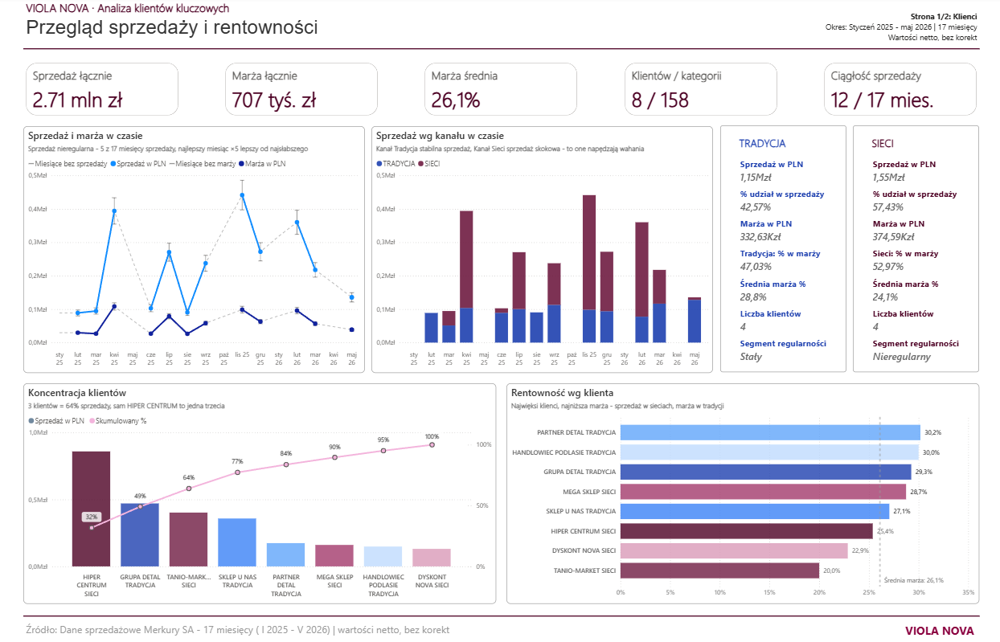
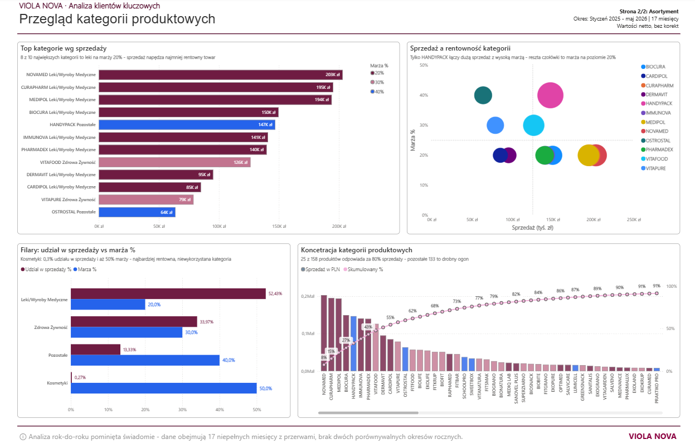

# VIOLA NOVA - Analiza sprzedaży i rentowności klientów kluczowych

> Power BI · Power Query · DAX · Modelowanie danych · Narracja oparta na danych

Dwustronicowy raport menedżerski (Power BI) opracowany na surowych danych transakcyjnych. Celem opracowania jest dostarczenie zarządowi obrazu sprzedaży i rentowności umożliwiającego prowadzenie dyskusji decyzyjnej, w odróżnieniu od raportu o walorze wyłącznie sprawozdawczym.

**Polski** · [English below](#-english)

---

## Spis treści

1. [Podgląd raportu](#1-podgląd-raportu)
2. [Kontekst opracowania](#2-kontekst-opracowania)
3. [Najważniejsze wnioski](#3-najważniejsze-wnioski)
4. [Dane źródłowe](#4-dane-źródłowe)
5. [Sposób opracowania raportu](#5-sposób-opracowania-raportu)
6. [Założenia projektowe](#6-założenia-projektowe)
7. [Wykorzystane narzędzia](#7-wykorzystane-narzędzia)

---

## 1. Podgląd raportu

### Strona 1 - Przegląd sprzedaży i rentowności (Klienci)

### Strona 2 - Kategorie produktowe (Asortyment)

---

## 2. Kontekst opracowania

Przedmiotem zadania było przygotowanie syntetycznego obrazu sprzedaży za rok 2025 i początek roku 2026 w segmencie klientów kluczowych, na potrzeby posiedzenia zarządu. Zakres analizy określono następująco:

- **Sprzedaż w czasie** - trend, sezonowość oraz istotne wahania (spadki i wzrosty) stanowiące o dynamice działalności.
- **Klienci** - identyfikacja podmiotów generujących największy obrót oraz największą marżę.
- **Kategorie produktowe** - rozróżnienie kategorii o najwyższej efektywności od kategorii obniżających wynik.
- **Interpretacja, nie wyłącznie wartości** - samodzielne wnioski analityczne.
- **Ograniczenie do dwóch stron** - wymóg podyktowany ograniczeniami czasowymi odbiorcy.

---

## 3. Najważniejsze wnioski

| Obszar | Wartość | Interpretacja |
|---|---:|---|
| Sprzedaż łączna | **2,71 mln zł** | obrót w 12 z 17 miesięcy- sprzedaż nieregularna |
| Marża łączna | **707 tys. zł** | przy marży średniej **26,1%** |
| Koncentracja klientów | **3 klientów = 64% obrotu** | sam HIPER CENTRUM ok. 32% - wysokie ryzyko zależności |
| Koncentracja asortymentu | **25 z 158 kategorii = 80% obrotu** | rozkład Pareto, długi ogon 133 kategorii |
| Sezonowość | miesiąc najwyższy **×5** wobec najniższego | listopad (441 tys.) wobec lutego (89 tys.) |
| Filar wiodący | **Leki/Wyroby Medyczne = 52% obrotu** | zarazem najniższa marża (20%) - obrót napędza towar najmniej rentowny |
| Paradoks rentowności | **Kosmetyki: 0,3% obrotu, 50% marży** | kategoria najbardziej rentowna, niewykorzystana |

### Wnioski dla działalności

1. **Ryzyko koncentracji.** Blisko dwie trzecie obrotu pozostaje uzależnione od trzech klientów. Utrata HIPER CENTRUM oznaczałaby ubytek około jednej trzeciej sprzedaży, co stanowi przesłankę na rzecz dywersyfikacji portfela.
2. **Rozróżnienie obrotu i zysku.** Kanał SIECI odpowiada za 57,4% obrotu, jego marża (24,1%) jest jednak niższa niż w kanale TRADYCJA (28,9%). Kanał tradycyjny, przy niższym obrocie, dostarcza nieproporcjonalnie wysoki udział zysku (46,8% marży z 42,6% obrotu).
3. **Struktura asortymentu wymagająca przeglądu.** Największy wolumen sprzedaży dotyczy towaru o najniższej rentowności (leki, marża 20%). Kategorie wysokomarżowe- w szczególności Kosmetyki (50%)- pozostają niemal nieobecne. Obszar ten wyznacza przestrzeń decyzyjną dotyczącą rozwoju struktury sprzedaży.
4. **HANDYPACK jako wyjątek.** Jedyna kategoria łącząca wysoki obrót z wysoką marżą; pozostałe pozycje czołowe charakteryzuje marża rzędu 20%.

> **Uwaga metodologiczna:** analizę rok-do-roku pominięto w sposób zamierzony. Dane obejmują 17 niepełnych, nieciągłych miesięcy, wobec czego nie istnieją dwa porównywalne okresy roczne. Prezentacja zmian rok-do-roku prowadziłaby do wniosków mylących.

---

## 4. Dane źródłowe

Trzy pliki tworzące model gwiazdy (*star schema*), udostępnione w formatach CSV (podgląd na GitHubie):

| Zbiór | Rola | Opis |
|---|---|---|
| `sprzedaz` ([csv](data/sprzedaz.csv)) | **Tabela faktów** | 2 412 wierszy transakcji: data, klient, kategoria, ilość, sprzedaż, marża |
| `klienci` ([csv](data/klienci.csv)) | **Wymiar** | 8 grup klientów: nazwa, kanał (SIECI/TRADYCJA), opiekun KAM |
| `produkty` ([csv](data/produkty.csv)) | **Wymiar** | 158 kategorii produktowych przypisanych do filarów wzrostu |

**Filary wzrostu:** Leki/Wyroby Medyczne · Zdrowa Żywność · Pozostałe · Kosmetyki

**Okres:** styczeń 2025 - maj 2026 (17 miesięcy, dane w 12) · wartości netto, bez korekt.

---

## 5. Sposób opracowania raportu

Pełna dokumentacja metodologiczna - architektura modelu, tabela czasu, zbiór miar **DAX**, kolumny obliczane, organizacja modelu oraz założenia projektowe- zawarta została w odrębnym pliku:

 **[METHODOLOGY.md](METHODOLOGY.md)**

Zwięźle:
1. **Model gwiazdy** - `FactSprzedaz` (fakty) oraz `DimDate`, `DimKlienci`, `DimProdukty` (wymiary) i `_Measures` (kontener miar). Relacje 1:*, jednokierunkowe.
2. **Tabela czasu w DAX** - kalendarz rozpoczynający się zawsze 1 stycznia roku pierwszej sprzedaży (bez stałych umownych), wyposażony w liczbowy klucz sortujący miesiące.
3. **Warstwy miar** - bazowe „bez korekt" (oczyszczone) udziały (kanał / produkty) liczności i czas karty KPI interpolacja luk.
4. **Warstwa wizualna** - dwie strony, każdy kafelek opatrzony tezą w nagłówku (narracja oparta na danych).

---

## 6. Założenia projektowe

- **Teza w tytule każdego wykresu.** Zamiast nagłówka neutralnego („Sprzedaż wg kanału") zastosowano sformułowanie interpretacyjne („Kanał Tradycja stabilny, Sieci skokowy- to one napędzają wahania"). Odbiorca otrzymuje wniosek, nie wyłącznie dane.
- **Dwie strony zamiast dziesięciu.** Ograniczenie zamierzone, zgodne z wytyczną odbiorcy, wymuszające priorytetyzację treści.
- **Wykresy Pareto** dla koncentracji klientów i kategorii- najczytelniejsza forma prezentacji ryzyka wynikającego z zasady „80/20".
- **Wykres bąbelkowy obrót × marża**- pojedyncza wizualizacja ukazująca rozmieszczenie obrotu, marży oraz ich współwystępowania (HANDYPACK).
- **Zamierzone pominięcie analizy rok-do-roku**, udokumentowane wprost w stopce raportu- rzetelność metodologiczna została przedłożona nad efektowny, lecz mylący wskaźnik.

---

## 7. Wykorzystane narzędzia

`Power BI Desktop` · `Power Query (M)` · `DAX` · `Excel` · modelowanie wymiarowe (star schema) · narracja oparta na danych

---
---

# English

# VIOLA NOVA - Key Account Sales and Profitability Analysis

> Power BI · Power Query · DAX · Data modelling · Data-driven narrative

A two-page management report (Power BI) developed on raw transactional data. The aim of the work is to provide the board with a picture of sales and profitability that permits decision-oriented discussion, as distinct from a report of purely reporting value.

---

## Table of contents

1. [Report preview](#1-report-preview)
2. [Context of the work](#2-context-of-the-work)
3. [Key findings](#3-key-findings)
4. [Source data](#4-source-data)
5. [Manner of the report's preparation](#5-manner-of-the-reports-preparation)
6. [Design assumptions](#6-design-assumptions)
7. [Tools employed](#7-tools-employed)

---

## 1. Report preview

### Page 1 - Sales and profitability overview (Customers)

### Page 2 - Product categories (Assortment)

---

## 2. Context of the work

The object of the task was the preparation of a synthetic picture of sales for the year 2025 and the beginning of 2026 in the key-account segment, for the purposes of a board meeting. The scope of the analysis was defined as follows:

- **Sales over time** - trend, seasonality, and material fluctuations (declines and increases) determining the dynamics of the business.
- **Customers** - identification of the entities generating the greatest turnover and the greatest margin.
- **Product categories** - the differentiation of categories of the highest effectiveness from categories depressing the result.
- **Interpretation, not values alone** - independent analytical conclusions.
- **Confinement to two pages** - a requirement dictated by the time constraints of the recipient.

---

## 3. Key findings

| Area | Value | Interpretation |
|---|---:|---|
| Total sales | **PLN 2.71M** | turnover in 12 of 17 months- irregular sales |
| Total margin | **PLN 707K** | at an average margin of **26.1%** |
| Customer concentration | **3 customers = 64% of turnover** | HIPER CENTRUM alone approx. 32% - high dependency risk |
| Assortment concentration | **25 of 158 categories = 80% of turnover** | Pareto distribution, long tail of 133 categories |
| Seasonality | highest month **×5** against the lowest | November (441K) against February (89K) |
| Leading pillar | **Medicines/Medical = 52% of turnover** | at once the lowest margin (20%) - turnover is driven by the least profitable goods |
| Profitability paradox | **Cosmetics: 0.3% turnover, 50% margin** | the most profitable category, unexploited |

### Conclusions for the business

1. **Concentration risk.** Close to two-thirds of turnover remains dependent on three customers. The loss of HIPER CENTRUM would entail a reduction of approximately one-third of sales, which constitutes grounds in favour of portfolio diversification.
2. **The differentiation of turnover and profit.** The SIECI (modern trade) channel accounts for 57.4% of turnover; its margin (24.1%) is, however, lower than that of the TRADYCJA (traditional trade) channel (28.9%). The traditional channel, at lower turnover, delivers a disproportionately high share of profit (46.8% of margin from 42.6% of turnover).
3. **An assortment structure requiring review.** The greatest sales volume pertains to goods of the lowest profitability (medicines, 20% margin). High-margin categories- in particular Cosmetics (50%)- remain almost absent. This area delineates a decision space concerning the development of the sales structure.
4. **HANDYPACK as an exception.** The sole category combining high turnover with a high margin; the remaining leading positions are characterised by a margin of the order of 20%.

> **Methodological note:** year-over-year analysis was omitted deliberately. The data comprise 17 incomplete, non-continuous months, and consequently no two comparable annual periods exist. The presentation of year-over-year changes would lead to misleading conclusions.

---

## 4. Source data

Three files forming a star schema, provided in CSV (previewable on GitHub):

| Dataset | Role | Description |
|---|---|---|
| `sprzedaz` ([csv](data/sprzedaz.csv)) | **Fact table** | 2,412 transaction rows: date, customer, category, quantity, sales, margin |
| `klienci` ([csv](data/klienci.csv)) | **Dimension** | 8 customer groups: name, channel (SIECI/TRADYCJA), KAM owner |
| `produkty` ([csv](data/produkty.csv)) | **Dimension** | 158 product categories assigned to growth pillars |

**Growth pillars:** Medicines/Medical · Healthy Food · Other · Cosmetics

**Period:** January 2025 - May 2026 (17 months, data in 12) · net values, corrections excluded.

---

## 5. Manner of the report's preparation

The full methodological documentation - model architecture, the time table, the set of **DAX** measures, calculated columns, model organisation, and design assumptions- has been contained in a separate file:

 **[METHODOLOGY.md](METHODOLOGY.md)**

In brief:
1. **Star schema** - `FactSprzedaz` (facts) together with `DimDate`, `DimKlienci`, `DimProdukty` (dimensions) and `_Measures` (a measure container). Relationships 1:*, single-direction.
2. **A time table in DAX** - a calendar commencing always on 1 January of the first sales year (without conventional constants), furnished with a numeric key for sorting months.
3. **Measure layers** - base "bez korekt" (cleaned) shares (channel / products) counts and time KPI cards gap interpolation.
4. **Visual layer** - two pages, each tile provided with a thesis in its header (data-driven narrative).

---

## 6. Design assumptions

- **A thesis in the title of each chart.** In place of a neutral header ("Sales by channel"), an interpretative formulation was applied ("The Traditional channel stable, Modern trade volatile- these drive the fluctuations"). The recipient obtains a conclusion, not values alone.
- **Two pages in place of ten.** A deliberate constraint, consistent with the recipient's guideline, enforcing the prioritisation of content.
- **Pareto charts** for the concentration of customers and categories- the most legible form of presenting the risk arising from the "80/20" principle.
- **A turnover × margin bubble chart**- a single visualisation depicting the distribution of turnover, margin, and their co-occurrence (HANDYPACK).
- **The deliberate omission of year-over-year analysis**, documented explicitly in the report footer- methodological integrity was given precedence over a striking yet misleading indicator.

---

## 7. Tools employed

`Power BI Desktop` · `Power Query (M)` · `DAX` · `Excel` · dimensional modelling (star schema) · data-driven narrative

---

*Repozytorium portfolio. Dane mają charakter rekrutacyjny/szkoleniowy. · Portfolio repository. The data are of a recruitment/training character.*
